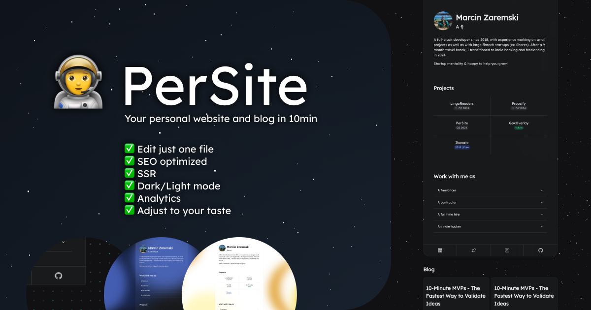

# 🧑‍🚀 Persite (one-click website & blog)

🛠️ Built with modern tech stack:

- Server-side rendering
- SEO optimized
- Markdown blog
- Simple Analytics

🚀 Easy to deploy:

- Deploy with one click
- Fill one file with your content

🎨 Highly customizable:

- 4 animated backgrounds
- Dark/Light mode
- Colors
- Border radius
- Scaling

## One click deploy

 
Live Example: https://persite.vercel.app/

## Tech stack

- Framework: [Remix](https://remix.run/docs)
- UI: [Radix Themes](https://www.radix-ui.com/themes)
- Deployment: [Vercel](https://vercel.com)
- Blog: [MDX](https://mdxjs.com/)
- REACT
- TypeScript
- Simpleanalytics [simpleanalytics](https://simpleanalytics.com/)

## Usage & Getting Started

1. Click "Deploy" at the top of the file.
2. Clone the repository was created by Vercel.
3. Install: `pnpm install` or `yarn install` or `npm install`
4. Open `PERSITE_SOURCE.tsx` and change the values to your own.
   - Preview the file: [PERSITE_SOURCE.tsx](https://github.com/mzaremski/persite/blob/main/PERSITE_SOURCE.tsx)
   - To customize theme, you can check this: [Radix playground](https://www.radix-ui.com/themes/playground) then edit `persiteSource.theme.radixConfig`
5. Start the development server: `pnpm run dev` or `yarn run dev` or `npm run dev`
6. Push to preview changes on your live website
7. Create an account on https://simpleanalytics.com/ and add your site URL. The script is already installed on the website.

## Useful links

1. Remix-MDX plugin integration: [Remix.run: Add MDX plugion](https://remix.run/docs/en/main/guides/vite#add-mdx-plugin)
2. Persite Landingpage: [Persite](https://mzaremski.com/persite)
3. **✨Check PRO plan of Persite Boilerplate✨**: [Persite PRO](https://mzaremski.com/persite#pro)
   - Waiting list form
   - More components
   - Dynamic OG images for blog
   - Indie Hacker Starter Pack (Set of checklists, tips, sources)
4. Persite public repository: [Repo](https://github.com/mzaremski/persite)

To run your Remix app locally, make sure your project's local dependencies are installed

## Author

by Marcin Zaremski 
GitHub: https://github.com/mzaremski 
Website: https://mzaremski.com/ 
Twitter: https://twitter.com/marcinzaremski 

